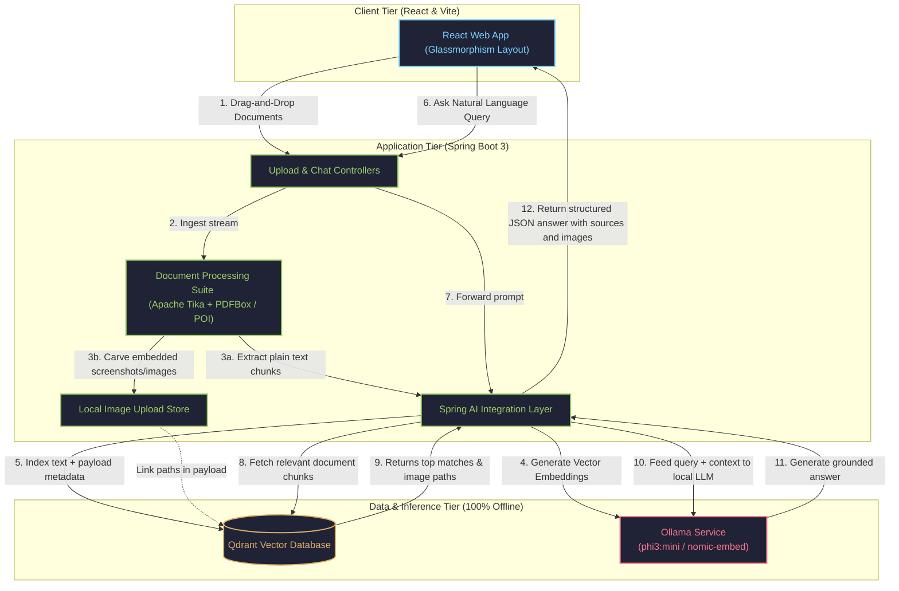

# 🚀 AI-Powered RAG Assistant with Screenshot Integration

A highly secure, offline-first, and **multimodal-ready RAG** (Retrieval-Augmented Generation) assistant. Engineered with **Spring Boot 3 (Spring AI)**, **React 18 (Vite)**, and a **Qdrant Vector Database**, it runs entirely locally using **Ollama**. The application stands out by extracting both plain text and embedded illustrations, screenshots, and diagrams from documents, letting the AI ground its responses with high fidelity and display visual evidence alongside answers.

---

## 🏗️ System Architecture

This system is built as a three-tier local architecture. It processes, embeds, indexes, and queries documents completely within your machine's perimeter.



---

## 🛠️ Why This Technology Stack?

Every element in this architecture is selected to deliver maximum privacy, lightning-fast processing, and enterprise-grade extensibility on consumer-grade hardware.

| Technology | Role | Why We Selected It |
| :--- | :--- | :--- |
| **Spring Boot 3 & Spring AI** | Backend Framework | Spring Boot 3 brings unmatched type-safety, rapid dependency injection, and native compilation capabilities to enterprise Java. **Spring AI** abstracts vector store operations, prompt engineering, and LLM integrations cleanly, allowing us to swap components or models with zero changes to core business logic. |
| **React 18 & Vite** | Frontend Interface | Vite delivers instantaneous Hot Module Replacement (HMR) and highly optimized production builds. React 18 allows us to create a premium, responsive glassmorphism UI with smooth asynchronous states during heavy document uploads and real-time streaming chat rendering. |
| **Qdrant Vector Database** | Vector Indexing | Written in Rust, Qdrant is an ultra-fast vector database engineered for production. It allows us to perform high-speed cosine similarity searches, and seamlessly supports complex payload filtering (allowing us to bind document metadata, sections, and extracted screenshot paths directly to the text vectors). |
| **Ollama (`phi3:mini` & `nomic-embed-text`)** | Local Inference | Ollama runs AI models locally on your CPU/GPU. **`nomic-embed-text`** provides high-quality 8192 token-context embeddings, and **`phi3:mini`** is an exceptionally powerful, lightweight 3.8B parameter instruct model. This ensures **100% data privacy** and **zero API costs**. |
| **Apache Tika & PDFBox / POI** | Content Extraction Suite | **Apache Tika** handles multi-format parsing (PDF, DOCX, TXT, HTML) under a unified interface. **Apache PDFBox** and **Apache POI** carve out embedded screenshots, illustrations, and figures directly from the binary layouts of PDFs and Word documents, enabling our multimodal-like pipeline. |

---

## 🌟 Key Features

* **Visual RAG Pipeline**: Ingests PDFs and DOCXs, automatically carves out embedded screenshots, and showcases them in a gorgeous lightbox gallery directly below corresponding AI answers.
* **Strict Anti-Hallucination Guard**: Configured with a rigorous `0.4` cosine similarity threshold and detailed system prompts, ensuring the model immediately refuses to answer if the ground-truth context is missing from your files.
* **Persistent Knowledge Base**: Full drag-and-drop support for multi-document ingestion with real-time indexing status trackers and persistent memory.
* **Premium UX/UI**: Designed using a gorgeous dark glassmorphism layout, featuring rich micro-animations, a clean responsive sidebar, and custom ReactMarkdown rendering.

---

## 🚀 Setup & Execution

### 1. Download Local AI Models
Open a terminal on your host machine and run the following commands to pull the necessary models via Ollama:
```bash
# Pull the instruction-tuned chat model
ollama pull phi3:mini

# Pull the text embedding model
ollama pull nomic-embed-text
```

### 2. Launch the Application Stack
From the project root directory, run Docker Compose to build and spin up the frontend, backend, and Qdrant container:
```bash
docker-compose up --build
```

### 3. Access Services
* **Web App UI**: `http://localhost:5173/` (or port 80 if running production Nginx)
* **Backend API**: `http://localhost:8080/`
* **Qdrant DB Console**: `http://localhost:6333/dashboard`

---

## 📁 Repository Structure

```text
rag-assistant/
├── backend/            # Spring Boot 3 Java Service
│   ├── src/            # Document parsing, image extraction, and Spring AI logic
│   └── pom.xml         # Maven dependencies
├── frontend/           # React 18 + Vite Web Application
│   ├── src/            # App layout, ChatWindow, and FileUpload components
│   └── package.json    # Node scripts and dependencies
├── uploads/            # Volumed local image store (gitignored)
├── qdrant_data/        # Persistent database storage (gitignored)
└── docker-compose.yml  # Docker multi-container orchestrator
```

# rag-assistant
