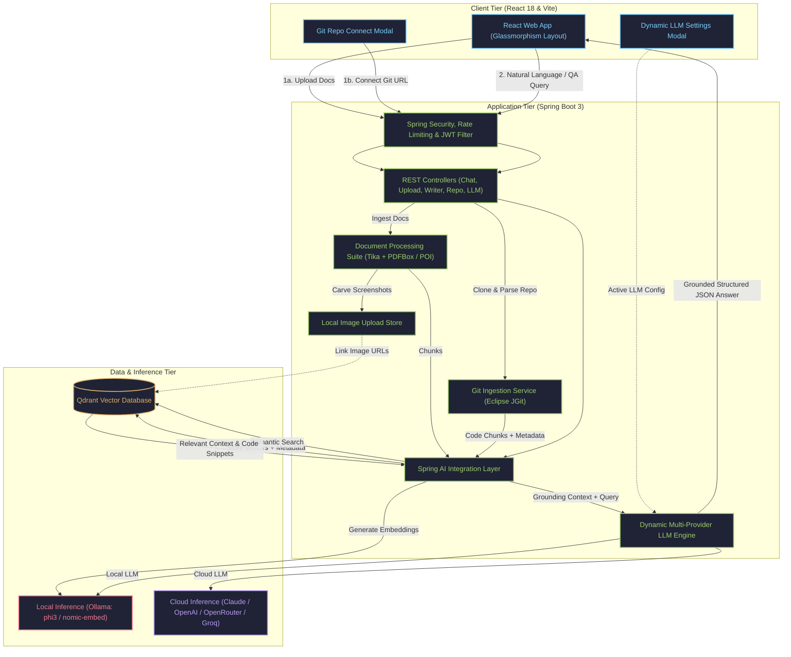

# AI-Powered RAG Assistant with Multimodal & Codebase Intelligence

A high-performance, offline-first, and **multimodal-ready RAG** (Retrieval-Augmented Generation) assistant. Engineered with **Spring Boot 3 (Spring AI)**, **React 18 (Vite)**, and a **Qdrant Vector Database**, it runs locally using **Ollama** or connects dynamically to leading AI providers (**Anthropic Claude**, **OpenAI**, **OpenRouter**, **Groq Cloud**, or custom endpoints). The assistant extracts text and embedded illustrations/diagrams from documents, clones and ingests **Git repositories** (GitHub, Bitbucket, GitLab), and grounds AI responses with transparent citations and visual evidence.

---

## System Architecture

The application runs as a modern, decoupled three-tier architecture that processes, embeds, indexes, and queries documents and codebases securely within your chosen perimeter.


```mermaid
graph TD
    %% Styling
    classDef default fill:#1a1b26,stroke:#7aa2f7,stroke-width:2px,color:#a9b1d6;
    classDef frontend fill:#1f2335,stroke:#7dcfff,stroke-width:2px,color:#7dcfff;
    classDef backend fill:#1f2335,stroke:#9ece6a,stroke-width:2px,color:#9ece6a;
    classDef database fill:#1f2335,stroke:#e0af68,stroke-width:2px,color:#e0af68;
    classDef ollama fill:#1f2335,stroke:#f7768e,stroke-width:2px,color:#f7768e;
    classDef cloud fill:#1f2335,stroke:#bb9af7,stroke-width:2px,color:#bb9af7;

    subgraph Client["Client Tier (React 18 & Vite)"]
        UI["React Web App (Glassmorphism Layout)"]:::frontend
        LLMModal["Dynamic LLM Settings Modal"]:::frontend
        RepoModal["Git Repo Connect Modal"]:::frontend
    end

    subgraph Server["Application Tier (Spring Boot 3)"]
        SecurityFilter["Spring Security, Rate Limiting & JWT Filter"]:::backend
        Controllers["REST Controllers (Chat, Upload, Writer, Repo, LLM)"]:::backend
        GitIngest["Git Ingestion Service (Eclipse JGit)"]:::backend
        Extractor["Document Processing Suite (Tika + PDFBox / POI)"]:::backend
        DynamicLLM["Dynamic Multi-Provider LLM Engine"]:::backend
        AIService["Spring AI Integration Layer"]:::backend
        ImgStore["Local Image Upload Store"]:::backend
    end

    subgraph DataInf["Data & Inference Tier"]
        VectorDB[("Qdrant Vector Database")]:::database
        LocalInf["Local Inference (Ollama: phi3 / nomic-embed)"]:::ollama
        CloudInf["Cloud Inference (Claude / OpenAI / OpenRouter / Groq)"]:::cloud
    end

    %% Ingestion Flows
    UI -->|1a. Upload Docs| SecurityFilter
    RepoModal -->|1b. Connect Git URL| SecurityFilter
    SecurityFilter --> Controllers
    Controllers -->|Ingest Docs| Extractor
    Controllers -->|Clone & Parse Repo| GitIngest
    Extractor -->|Carve Screenshots| ImgStore
    Extractor -->|Chunks| AIService
    GitIngest -->|Code Chunks + Metadata| AIService
    AIService -->|Generate Embeddings| LocalInf
    AIService -->|Store Vectors + Metadata| VectorDB
    ImgStore -.->|Link Image URLs| VectorDB

    %% Query Flows
    UI -->|2. Natural Language / QA Query| SecurityFilter
    SecurityFilter --> Controllers
    Controllers --> AIService
    AIService -->|Semantic Search| VectorDB
    VectorDB -->|Relevant Context & Code Snippets| AIService
    AIService -->|Grounding Context + Query| DynamicLLM
    LLMModal -.->|Active LLM Config| DynamicLLM
    DynamicLLM -->|Local LLM| LocalInf
    DynamicLLM -->|Cloud LLM| CloudInf
    DynamicLLM -->|Grounded Structured JSON Answer| UI
```

---

## Why This Technology Stack?

Every element in this architecture is selected to deliver maximum privacy, lightning-fast processing, and enterprise-grade extensibility on consumer-grade hardware.

| Technology | Role | Why We Selected It |
| :--- | :--- | :--- |
| **Spring Boot 3 & Spring AI** | Backend Framework | Spring Boot 3 brings unmatched type-safety, rapid dependency injection, and native compilation capabilities to enterprise Java. **Spring AI** abstracts vector store operations, prompt engineering, and LLM integrations cleanly. |
| **React 18 & Vite** | Frontend Interface | Vite delivers instantaneous Hot Module Replacement (HMR) and optimized production builds. React 18 provides a responsive glassmorphism UI with smooth animations via Framer Motion. |
| **Qdrant Vector Database** | Vector Indexing | Written in Rust, Qdrant is an ultra-fast vector database engineered for production. It supports high-speed cosine similarity searches and flexible payload filtering by workspace and document type. |
| **Dynamic Multi-Provider LLM Engine** | Flexible AI Routing | Supports local privacy with **Ollama** (`phi3:mini`, `llama3.1`, `qwen2.5-coder`, `deepseek-r1`) as well as cloud providers (**Anthropic Claude 3.5**, **OpenAI GPT-4o**, **Groq Cloud**, **OpenRouter**, or custom OpenAI-compatible proxies). |
| **Eclipse JGit** | Git Repository Ingestion | Native Java Git library to clone, branch-inspect, and ingest source repositories from GitHub, GitLab, Bitbucket, and private Git servers directly into vector pools. |
| **Apache Tika & PDFBox / POI** | Content Extraction Suite | **Apache Tika** handles multi-format parsing (PDF, DOCX, TXT, HTML). **Apache PDFBox** and **Apache POI** carve embedded screenshots, illustrations, and figures directly from binary layouts. |

---

## Key Features

* **Dynamic Multi-Provider AI Engine**: Switch between **OpenAI**, **Anthropic Claude**, **Ollama (Local)**, **OpenRouter**, **Groq Cloud**, or custom OpenAI-compatible proxies on the fly with per-provider model presets, temperature tuning, and a live connection latency tester.
* **Git Codebase Ingestion (GitHub, GitLab, Bitbucket)**: Connect public and private Git repositories with token/app password authentication. The engine parses source code files, attaches language and file path metadata, and chunks code for syntax-aware technical Q&A.
* **QA & Engineering Quick Workflows**: One-click prompt accelerators in the QA Chat Assistant:
  * 🧪 *Generate BDD Test Cases* (Gherkin Given-When-Then positive/negative/edge cases)
  * 📋 *Extract Validation Rules* (Input constraints, error codes, and business validations)
  * 🔌 *API Contracts & Payloads* (REST endpoints, HTTP verbs, and request/response schemas)
  * 🛡️ *Security & Boundary Audit* (Authentication boundaries, sanitization, and edge conditions)
  * 🧩 *Unit / Mock Test Suite* (JUnit 5 / Mockito / Jest scaffolding)
* **Grounded Inline Citations**: AI answers include interactive citation badges (e.g. `[1]`, `[2]`). Hovering displays a glassmorphic tooltip with file names, file paths, programming languages, page numbers, and exact grounded context snippets.
* **Visual RAG Pipeline**: Ingests PDFs and DOCX files, automatically carves out embedded illustrations, charts, and screenshots, and displays visual evidence directly within AI responses with click-to-enlarge galleries.
* **Generative Document Writer & Exporter**: In-context drafting assistant with presets for SLA Agreements, Technical Specs, Project Roadmaps, and Privacy Policies, complete with offline markdown and styled Print-to-PDF export.
* **Self-Correction Relevance Grader (Corrective RAG)**: Anti-hallucination guard that runs a fast relevance grading pass, refusing to guess if retrieved context is insufficient.
* **Isolated Multi-Workspaces (Qdrant Vector Pools)**: Segregates documents and repositories into distinct workspace pools using Qdrant payload filters.
* **Resilient Authentication & Rate Limiting**: Zero-trust architecture with JWT authentication, silent auto-refresh retry interceptors, sliding-window rate limiting, and cross-platform path traversal protection.

---

## Setup & Execution

### 1. Download Local AI Models (Optional for Local Ollama)
If using local inference with Ollama, run:
```bash
# Pull the instruction-tuned chat model
ollama pull phi3:mini

# Pull the text embedding model
ollama pull nomic-embed-text
```

### 2. Configure Environment Variables
Copy `.env.example` to `.env` and configure credentials:
```bash
cp .env.example .env
```

### 3. Launch the Application Stack
Run Docker Compose from the repository root:
```bash
docker-compose up --build
```

### 4. Access Services
* **Web App UI**: `http://localhost:5173/` (or port 80 if running production Nginx)
* **Backend API**: `http://localhost:8080/`
* **Swagger API Docs**: `http://localhost:8080/swagger-ui/index.html`
* **Qdrant DB Console**: `http://localhost:6333/dashboard`

---

## API Endpoints

| Endpoint | Method | Description | Auth Required |
| :--- | :--- | :--- | :--- |
| `/api/auth/login` | `POST` | Authenticate user and receive access + refresh JWTs | No |
| `/api/auth/refresh` | `POST` | Refresh expired access token using refresh token | No |
| `/api/chat/ask` | `POST` | Ask a grounded question with optional history & dynamic LLM config | Yes |
| `/api/chat/stream` | `POST` | Stream chat completions via Server-Sent Events (SSE) | Yes |
| `/api/documents/upload` | `POST` | Upload and vectorize PDF, DOCX, or TXT documents | Yes |
| `/api/repository/connect` | `POST` | Clone, vectorize, and index a Git repository | Yes |
| `/api/repository/providers` | `GET` | List supported Git repository providers | Yes |
| `/api/llm/test` | `POST` | Test connection and measure latency for an LLM config | Yes |
| `/api/llm/presets` | `GET` | Retrieve default provider presets and recommended models | Yes |
| `/api/writer/generate` | `POST` | Generate grounded document drafts from vector store context | Yes |
| `/api/images/{filename}` | `GET` | Serve carved screenshots and document illustrations | No |

---

## Repository Structure

```text
rag-assistant/
├── backend/            # Spring Boot 3 Java Service
│   ├── src/            # Document parsing, Git ingestion, Spring AI & dynamic LLM services
│   ├── pom.xml         # Maven dependencies (Spring AI, JGit, Tika, PDFBox, JJWT)
│   └── Dockerfile      # Backend container build definition
├── frontend/           # React 18 + Vite Web Application
│   ├── src/            # ChatWindow, DocumentWriter, FileUpload, Repo & LLM Modals
│   ├── nginx.conf      # SPA routing & API reverse proxy configuration
│   ├── Dockerfile      # Frontend production Nginx build definition
│   └── package.json    # Node dependencies and scripts
├── uploads/            # Local carved image storage (volume-mounted)
├── qdrant_data/        # Persistent vector database storage
├── .github/workflows/  # GitHub Actions CI pipeline (backend verify + frontend lint/build)
├── .env.example        # Environment variable templates
└── docker-compose.yml  # Multi-container service orchestrator
```
